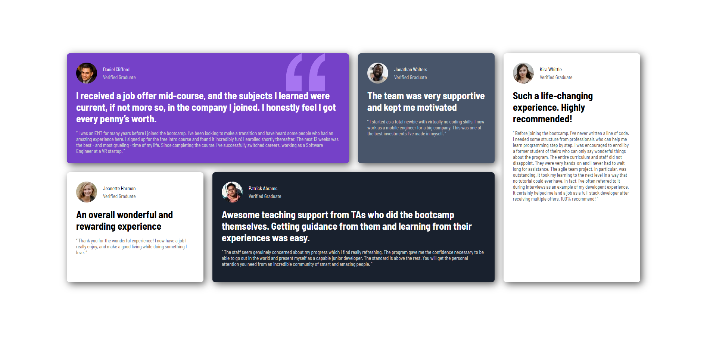

# Frontend Mentor - Testimonials Grid Section

This is a solution to the **Testimonials Grid Section** challenge on Frontend Mentor.  
The project showcases a responsive testimonials layout using CSS Grid and modern styling techniques.

## Overview

### The challenge

Users should be able to:

- View the optimal layout depending on their device's screen size
- See a clean and responsive testimonials grid
- Experience a modern card-based UI layout

### Screenshot




---

## Links

- Solution URL: [Live solution](https://www.frontendmentor.io/solutions/responsive-grid-testimony-9M1Lcz8HGJ)
- Live Site URL: [LIVE URL](https://victor-viktor.github.io/testimony/)

---

## Built with

- Semantic HTML5
- CSS3
- CSS Grid
- Flexbox
- Mobile-first workflow
- Responsive Design

---

## Features

- Responsive testimonials grid layout
- Modern card UI design
- CSS Grid positioning
- Custom typography using Google Fonts
- Different testimonial card styles and themes
- Desktop and mobile responsive layouts

---

## What I learned

During this project, I practiced:

- Building complex layouts with CSS Grid
- Creating responsive designs using media queries
- Structuring semantic HTML content
- Organizing reusable CSS classes
- Working with typography and spacing systems
- Improving visual hierarchy in UI design

Example of the grid layout used:

```css
.gridContainer {
    display: grid;
    grid-template-columns: repeat(4, 1fr);
}
```

---

## Continued development

In future versions, I would like to:

- Improve accessibility
- Add subtle animations and transitions
- Refactor the CSS architecture
- Improve scalability with CSS variables
- Optimize responsiveness for more screen sizes

---

## Useful resources

- MDN Web Docs - CSS Grid → https://developer.mozilla.org/en-US/docs/Web/CSS/CSS_grid_layout
- Frontend Mentor → https://www.frontendmentor.io

---

## Author

- Frontend Mentor - [@Victor-Viktor](https://www.frontendmentor.io/profile/Victor-Viktor)
- GitHub - [@Victor-Viktor](https://github.com/Victor-Viktor)

---

## Acknowledgments

Thanks to Frontend Mentor for providing awesome front-end challenges that help developers improve their skills with real-world projects.
